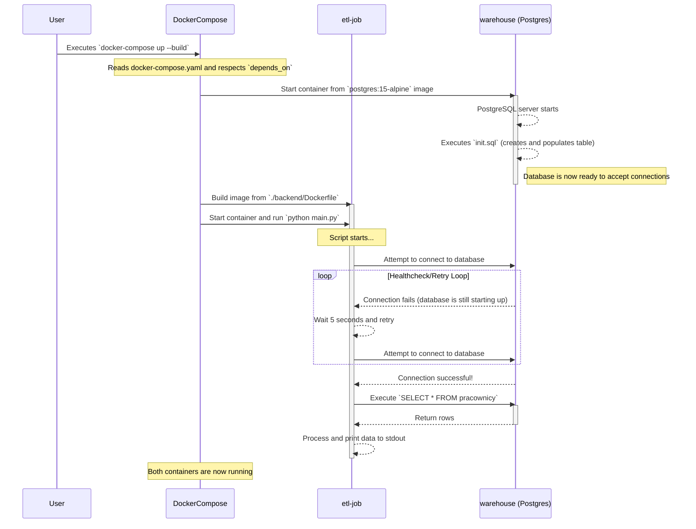

# Project Overview

This project is a simple ETL (Extract, Transform, Load) pipeline orchestrated with Docker Compose. It consists of two main services:

*   **`etl-job`**: A Python application that connects to a PostgreSQL database, extracts data from a `pracownicy` table, and prints a report to the console.
*   **`warehouse`**: A PostgreSQL database instance, pre-populated with sample data.

The project demonstrates a basic data processing workflow and the use of Docker for creating a reproducible development environment.

## Workflow Diagram

